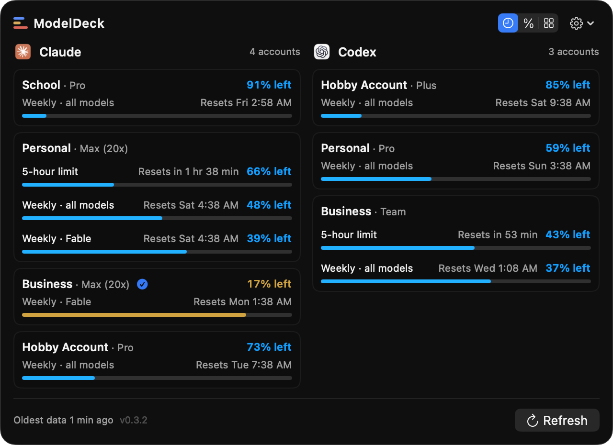
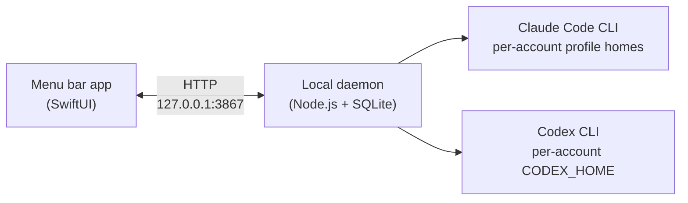

<div align="center">

# ModelDeck

**One menu bar icon that always knows how much Claude Code and Codex you have left.**

A native macOS menu bar app + local daemon that tracks usage limits across
all of your Claude Code and Codex CLI accounts — live "% left" meters,
reset countdowns, and one-click account switching. Everything stays on your
machine.


</div>

<!-- SCREENSHOT PLACEHOLDER: hero shot — menu bar icon + open two-column deck
     popover showing several accounts with % left bars and reset countdowns.
     Suggested path: docs/images/deck-popover.png -->
<!--  -->

---

## Why

If you run AI coding agents seriously, you probably don't have *one*
account — you have a work Claude Max plan, a personal Pro plan, a Codex
subscription, maybe a spare for side projects. Each one has its own
5-hour session window, weekly limit, and model-scoped caps, all resetting
on different clocks.

Today the only way to know where you stand is to interrupt what you're
doing and check each account by hand — usually right after an agent run
dies mid-task because a limit you forgot about ran out.

ModelDeck puts all of it in your menu bar:

- **See every limit at once.** Every account, every window (5-hour session,
  weekly, model-scoped like "Weekly · Fable"), as a live "% left" meter with
  its next reset time.
- **Get warned before you hit the wall.** The menu bar icon shows a gold
  percentage when any account drops below your threshold, red when critical,
  and a macOS notification fires exactly once at the crossing — no nagging.
- **Switch accounts in one click.** Activate a different account for new
  CLI sessions without touching anything that's already running.

## Features

- **Live usage deck** — a popover with one card per account: worst-window
  headline bar, plan tier ("Max (20x)", "Pro"), and expandable detail rows
  for every rate-limit window with right-aligned reset countdowns in your
  time zone.
- **Both providers, side by side** — Claude Code and Codex CLI columns with
  their brand marks, or a single-column layout if you prefer. Sort by next
  reset, lowest remaining, or provider.
- **Model-scoped weekly limits** — per-model caps are parsed and shown as
  first-class meters, not buried in a tooltip.
- **Account activation** — each provider has one active account for *new*
  terminal sessions. Activation atomically swaps isolated per-account
  profile homes; running sessions are never stopped, logged out, or touched.
- **Isolated profile homes** — every account lives in its own owner-only
  config home (`CLAUDE_CONFIG_DIR` / `CODEX_HOME`), macOS Keychain-aware,
  so identities never bleed into each other.
- **Transition-only notifications** — a banner when an account *crosses*
  your remaining-% threshold, silence otherwise. Thresholds configurable.
- **Menu bar at-a-glance state** — plain glyph when healthy, gold "% left"
  beside it when anything is low, red at critical, back to plain on recovery.
- **Guided add-account flow** — three steps: name it, sign in through the
  provider's own browser login, confirm the identity ModelDeck read back.
  ModelDeck never sees your password or token.
- **CLI health** — installed vs. latest versions of Claude Code and Codex
  CLI, with auth-state chips per account ("Healthy" / "Sign in again").

<!-- SCREENSHOT PLACEHOLDER: settings window, Accounts pane with health chips
     and Activate controls. Suggested path: docs/images/settings-accounts.png -->

## How it works



- **The app** (`macos/ModelDeckMac/`) is a SwiftPM `MenuBarExtra` app — no
  Xcode project, no Electron. It is a pure client of the daemon's
  localhost API.
- **The daemon** (`src/`) binds to `127.0.0.1` only, rejects unexpected
  Host/Origin headers, and requires a per-server token plus a
  `SameSite=Strict` cookie for every mutation. State lives in an owner-only
  SQLite database under `~/Library/Application Support/ModelDeck/`.
- **Usage reads** go through each provider's own channel: Codex via the
  official `codex app-server` stdio protocol, Claude via Anthropic's native
  usage endpoint using only the credential already stored in that profile —
  ModelDeck never initiates logins, never refreshes tokens, and never
  persists credentials.

## Privacy: local-first, by design

This is the point of the tool, so it's worth being explicit:

| | |
|---|---|
| Cloud services | **None.** No backend, no sync, no accounts. |
| Telemetry | **None.** Nothing is phoned home, ever. |
| Credentials | **Never copied or persisted by ModelDeck.** Sign-in happens in the provider's own browser flow, and credentials stay in the provider-managed profile/Keychain; ModelDeck uses them in place, at runtime, only for usage and auth-state reads. |
| Network | Daemon binds to `127.0.0.1` only. Outbound calls go solely to the providers you already use, with credentials they already hold. |
| Removal | Removing an account deletes only ModelDeck's reference — never your Keychain entries or provider auth state. |

## Install

ModelDeck is build-from-source today. A signed, notarized DMG is on the
[roadmap](design/mac-app-roadmap.md).

**Requirements:** macOS 14+, Node.js 24+, Swift toolchain (Xcode Command
Line Tools). The Claude Code and/or Codex CLIs for live usage tracking.

**1. Start the daemon**

```bash
git clone https://github.com/timharris707/modeldeck.git
cd modeldeck
npm install
npm start        # daemon on 127.0.0.1:3867
```

To run it permanently as a login agent instead:

```bash
scripts/set-mutation-token.sh                # one-time Keychain token setup
scripts/install-launch-agent.sh --port 3867  # installs + starts the launchd agent
```

**2. Run the app**

```bash
cd macos/ModelDeckMac
swift run ModelDeckMac
```

Or assemble a signed `.app` bundle (ad-hoc by default):

```bash
macos/ModelDeckMac/Scripts/build_app.sh
```

**3. Add accounts**

Open **Settings → Accounts → Add Account** and follow the three-step flow
for each account — e.g. "Work", "Personal", "Side Project". Each gets its
own isolated profile home and its own browser sign-in.

## Development

```bash
npm test                              # daemon test suite
cd macos/ModelDeckMac && swift test   # app test suite
```

See [`macos/ModelDeckMac/README.md`](macos/ModelDeckMac/README.md) for the
app package layout and [`DESIGN.md`](DESIGN.md) for the daemon's safety
contract and architecture decisions.

## Roadmap

The native app shipped as `v0.2.0` and is in active daily use. What's next —
retiring the legacy web dashboard, packaging, and distribution — lives in
[`design/mac-app-roadmap.md`](design/mac-app-roadmap.md), with the design
authority in [`design/mac-app-spec.md`](design/mac-app-spec.md).

## License

ModelDeck is source-visible and free for personal, noncommercial use under
the [PolyForm Noncommercial License 1.0.0](LICENSE.md): read the code, build
it, run it on your own machine, and share it noncommercially. Commercial
rights are reserved by the author — if you want to use ModelDeck
commercially, open an issue and ask.

## Contributing

Issues and pull requests are welcome — contributions are accepted under the
same [license](LICENSE.md) as the project. Bug reports with the daemon's
`/api/health` output and your macOS + CLI versions are especially useful.
Please don't include real account identities or usage data in issues —
placeholder labels are fine.
